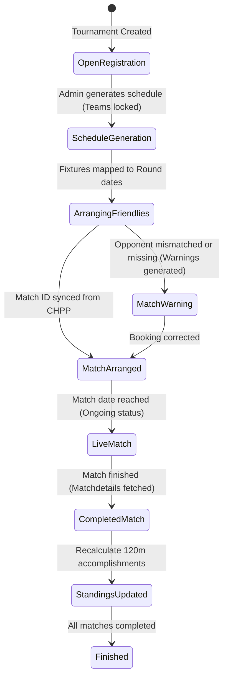

# HT-120min Technical Investigation Report

This report outlines our comprehensive understanding of the **HT-120min Tournament Manager** codebase, including product workflows, architecture, domain rules, data flows, database schemas, and technical observations.

**Important:**

- Documentation is not automatically correct.
- Treat documentation and `investigation_report.md` as hypotheses.
- Before changing behavior, verify assumptions against actual implementation and database schema.
- If documentation and code disagree, explicitly identify the discrepancy and explain which source appears authoritative.

---

## 1. Product Understanding

### What Problem the Project Solves

- **Friendly Coordination Overhead:** Small Hattrick communities coordinate friendly matches via forum threads, spreadsheets, and private messaging. This platform automates scheduling, pairing, result tracking, and event monitoring. `[Confirmed by documentation (AGENTS.md)]`
- **Training Optimization:** In Hattrick, players receive weekly training based on their played minutes (up to 90 or 120 minutes). Friendly matches that end in a draw under cup rules go to extra time (an additional 30 minutes). Playing a friendly for 120 minutes provides a massive training boost. Communities organize these tournaments where the objective is **not** strictly to win, but to force matches to draw and go to extra time (often using the "Pressing" tactic to minimize scoring). `[Confirmed by documentation (AGENTS.md, AGENTS_CHPP_INTEGRATION.md) and code (standings.ts)]`

### Target Users

- **Hattrick Organizers:** Long-time community members who volunteer to manage local friendly tournaments. They are not necessarily highly technical, and currently rely on manual spreadsheets. `[Confirmed by documentation (AGENTS.md)]`
- **Hattrick Managers:** Long-time players who want a fast, automated way to find 120-minute friendly opponents and participate in structured leagues without manual coordination. `[Confirmed by documentation (AGENTS.md)]`

### Core Workflows

1. **Tournament Creation:** Organizers create a tournament, setting constraints like private/public, scoring mode (120min vs points), country limits, and league category filters (male vs HFI). `[Confirmed by code (CreateTournament.tsx)]`
2. **Registration / Join:** Managers connect their Hattrick account via CHPP OAuth and select an eligible team to register in the tournament. `[Confirmed by code (AuthCallback.tsx, callback.ts, complete.ts)]`
3. **Fixture Generation:** The organizer triggers schedule generation, creating round-robin or recurring match fixtures. `[Confirmed by code (scheduler.ts)]`
4. **Matchmaking (Tinder):** Managers who are not in a tournament (or need one-off training partners) swipe on cards of available teams. They match and receive booking links to schedule friendlies manually on Hattrick. `[Confirmed by code (Matchmaker.tsx) and Confirmed by documentation (plans/ht-120min_Tinder_UX_Finalization.md)]`
5. **Fixture & Live Monitoring:** The platform periodically polls Hattrick for booked friendlies (confirming correct pairings and home/away arenas) and tracks live matches in real-time, feeding events (goals, cards, injuries) to the chat. `[Confirmed by code (refresh-fixtures.ts, live-matches.ts)]`
6. **Result Sync & Standings:** When matches end, final scores, played minutes, and extra-time achievements are recorded. Standings are recalculated in real-time. `[Confirmed by code (live-matches.ts, standings.ts)]`

### Design Philosophy

- **Nostalgic & Nostra-themed Visuals:** Hand-drawn cartoon illustrations, vibrant greens, dark themes, and Hattrick terminology (e.g. HFI, Pressing). It avoids generic corporate SaaS aesthetics. `[Confirmed by documentation (AGENTS.md) and code (Home.tsx, Matchmaker.tsx)]`
- **Pragmatic Automation:** Prioritize working manual flows (such as displaying direct Hattrick booking links) over waiting for automated write-access features (like programmatic challenge invites via `challenges.xml`). `[Confirmed by documentation (AGENTS.md) and plans/ht-120min_Tinder_UX_Finalization.md]`

---

## 2. Technical Architecture

### Frontend Structure

- **Tech Stack:** Vite + React 19 + TypeScript (no explicit `any` policy) + React Router v7. Styles are handled via Sass modules. `[Confirmed by documentation (AGENTS.md) and code (package.json, App.tsx)]`
- **Routing Map (`App.tsx`):**
  - `/` -> `Home`: Hero banner, active tournaments, open registrations list, Matchmaker widget, and supporters wall.
  - `/create` -> `CreateTournament`: Form steps for name, rules, country restriction, and finalization.
  - `/t/:slug` -> `TournamentView`: Main dashboard. Contains tabs: **Standings** (with chat widget aside), **Fixtures & Results** (with forum copy button), **News** (with team/admin updates and reactions), and **Admin** (password-protected controls).
  - `/matchmaker` & `/tinder` -> `Matchmaker`: Tinder-style swipe matcher, filterable by HFI (Female Zone) and available teams.
  - `/supporters` -> `SupportersPage`: Dedicated wall honoring community supporters.
  - `/auth/callback` -> `AuthCallback`: Receives Hattrick OAuth tokens, triggers backend completion, and redirects.
  `[Confirmed by code (App.tsx) and screenshots]`

### Backend Structure

- **Vercel Serverless Functions (`/api`):**
  - `/api/auth/init.ts`: Requests request token from Hattrick and starts OAuth flow.
  - `/api/auth/callback.ts`: Handles Hattrick authorization callback, fetches manager details, filters eligible teams, and issues selection tokens.
  - `/api/auth/complete.ts`: Persists final tokens, updates/creates manager profile, registers the team if joining, and completes authorization.
  - `/api/auth/pending.ts`: Fetches temporary session details for team selection.
  - `/api/chpp/live-matches.ts`: Accesses Hattrick `matchdetails.xml` for active matches to sync ongoing status, events, goals, and extra time.
  - `/api/chpp/proxy.ts`: Generic proxy to sign and forward reads to Hattrick.
  - `/api/teams/refresh-fixtures.ts`: Fetches all team friendlies, compares dates against country slots, and records warning records for misarranged friendlies.
  - `/api/matchmaker/teams.ts`: Fetches a manager's current teams from CHPP and performs live booking checks to mark availability.
  - `/api/matchmaker/publish.ts`: Validates booking status, registers a team local row, and creates/updates an open matchmaker request.
  - `/api/matchmaker/booking-status.ts`: Performs a one-off CHPP check to see if a team has booked a friendly.
  `[Confirmed by code (api/)]`

### Database Structure

The database runs on Supabase (PostgreSQL). Below is the evolved schema mapped from schema definitions and migrations:

```mermaid
erDiagram
    tournaments ||--o{ teams : "contains"
    tournaments ||--o{ rounds : "has"
    rounds ||--o{ matches : "contains"
    teams ||--o{ matches : "plays in (home/away)"
    profiles ||--o{ teams : "owns"
    profiles ||--o{ matchmaker_requests : "posts"
    teams ||--o{ matchmaker_requests : "publishes"
    matchmaker_requests ||--o{ matchmaker_views : "tracked in"
    tournaments ||--o{ news_posts : "announces"
    teams ||--o{ news_posts : "authors"
    news_posts ||--o{ news_reactions : "receives"
    tournaments ||--o{ tournament_chat : "contains"

    tournaments {
        uuid id PK
        text slug UNIQUE
        text name
        text admin_password
        text scoring_mode "120min / points"
        boolean is_private
        text description
        boolean show_description
        bigint organizer_id
        text image_url
        timestamp last_fixtures_refresh
        boolean is_test
        text status "open / active / finished / waiting"
    }

    profiles {
        bigint hattrick_user_id PK
        text manager_name
        integer country_id
        text country_name
        jsonb avatar_json
        jsonb teams_json "cached list of owned teams"
        text oauth_token
        text oauth_token_secret
        integer league_id
        timestamp chpp_synced_at
    }

    teams {
        uuid id PK
        uuid tournament_id FK "nullable (for matchmaker-only teams)"
        text name
        bigint ht_team_id
        boolean active
        uuid replacement_for_team_id FK
        bigint hattrick_user_id FK "linked to profiles"
        text logo_url
        text country_name
        boolean joined_via_oauth
        integer gender_id "1 = Men, 2 = Women"
        integer fanclub_size
        bigint arena_id
        integer arena_size
        text arena_image_url
        text oauth_token "legacy or team-level token"
        text oauth_token_secret "legacy"
    }

    matches {
        uuid id PK
        uuid round_id FK
        uuid home_team_id FK
        uuid away_team_id FK
        integer home_goals
        integer away_goals
        boolean went_120
        boolean completed
        text status "not_arranged / arranged / ongoing / misarranged / finished"
        bigint ht_match_id
        integer match_type
        integer total_minutes
        boolean venue_mismatch
        bigint actual_ht_home_team_id
        bigint actual_ht_away_team_id
    }

    matchmaker_requests {
        uuid id PK
        uuid team_id FK
        bigint manager_ht_id FK
        text match_type "120min / 90min_acceptable"
        text opponent_location "domestic / international / any"
        text home_away "home / away / any"
        text match_day
        text time_window
        text message
        text status "open / matched / expired / cancelled"
        uuid matched_with_team_id FK
        timestamp matched_at
        timestamp expires_at
        boolean is_back_and_forth
        boolean is_long_term
        integer gender_id "denormalized for filtering"
    }
```

`[Confirmed by code (supabase-schema.sql, migrations/)]`

### CHPP Integration

- **OAuth 1.0a Handshake:** Handled via custom HMAC-SHA1 signature calculations. Client-side interactions are proxied through serverless handlers to keep keys secure. `[Confirmed by code (api/_lib/chpp-auth.ts, App.tsx)]`
- **XML Data Querying:** Fetches data payloads directly from `chpp.hattrick.org/chppxml.ashx`. `[Confirmed by code (api/_lib/chpp-xml.ts)]`
- **Regex Parsing (`api/_lib/chpp-xml.ts`):** Instead of using a bulky XML DOM parsing library, the codebase uses lightweight, fast regex patterns (e.g. `block.match(/<HomeTeamID>(\d+)<\/HomeTeamID>/)`) to extract values. `[Confirmed by code (api/_lib/chpp-xml.ts)]`

### Important Data Flows

- **The Registration / Join flow:**
  1. A user clicks "Join" or "Create". Client initiates by hitting `/api/auth/init`, generating a request token.
  2. The user authorizes the application on Hattrick, returning to `/api/auth/callback`.
  3. The callback handler queries Hattrick's `managercompendium` XML. It parses and filters the manager's teams to those matching the tournament rules (e.g. matching HFI female criteria or country limits).
  4. If multiple teams are eligible, the user is redirected to the tournament view with a `token` search parameter. The client detects the token, displays the `<TeamSelectorModal>` populated with the eligible teams, and prompts the user to select one.
  5. Upon confirmation, the client sends a `POST` request to `/api/auth/complete` which registers the selected team in the database.
  `[Confirmed by code (callback.ts, complete.ts, TournamentView.tsx)]`

- **The Ticker / Live Synchronization flow:**
  1. For active/ongoing matches, the client polls `/api/chpp/live-matches` containing the relevant `ht_match_id` values.
  2. The backend fetches Hattrick's `matchdetails` XML (`file=matchdetails&version=3.0&matchEvents=true`).
  3. It detects if a match is completed by checking `<MatchStatus>2</MatchStatus>` or scanning for a valid `<FinishedDate>`.
  4. Extra-time is determined by checking for `<MatchPart>3</MatchPart>` or `<MatchPart>4</MatchPart>` nodes.
  5. If completed, it updates the `matches` database entry (`completed: true`, `status: 'finished'`, goals, `went_120`, and `total_minutes`). Standings updates propagate instantly through Supabase Realtime and in-memory client-side calculations.
  `[Confirmed by code (live-matches.ts, useLiveMatches.ts, standings.ts)]`

---

## 3. Domain Model

### Entities

- **Managers (Profiles):** The parent entity for users. Captures Hattrick name, ID, home country, and avatar graphics layers. `[Confirmed by code (supabase-schema.sql, migrations/024_create_profiles.sql)]`
- **Teams:** A specific Hattrick club owned by a manager. Teams can exist in the DB independently of tournaments (e.g. for Matchmaker availability listings) or be linked to a tournament. `[Confirmed by code (supabase-schema.sql, migrations/031_general_teams.sql)]`
- **Tournaments:** The contest framework. Dictates the layout format, constraints, and scoring.
  - **Scoring Modes:**
    - `120min` (120m training mode): Rank ordered by `achievements120min` (how many games played extra time) -> Goal Difference -> Goals Scored -> Played (ascending).
    - `points` (classic league mode): Rank ordered by Points -> Goal Difference -> Goals Scored.
    `[Confirmed by code (supabase-schema.sql, standings.ts)]`
- **Rounds:** Represent a calendar match-week in a tournament. Maps to a specific Hattrick weekly friendly slot. `[Confirmed by code (supabase-schema.sql)]`
- **Matches:** A scheduled matchup between two tournament teams. Connects back to a real Hattrick Match ID (`ht_match_id`) once booked. `[Confirmed by code (supabase-schema.sql)]`
- **Warnings (Fixture Warnings):** Warnings generated when a team has booked a friendly on Hattrick with the wrong opponent or date for the scheduled round. Warnings scale from **yellow** to **red** (for consecutive or multiple violations). `[Confirmed by code (refresh-fixtures.ts) and migrations/023_add_fixture_warnings.sql]`
- **Matchmaker Listings:** Open ads seeking friendly partners. Valid until the weekly expiry (Tuesdays 06:00 UTC). Can specify preferences (Location, Home/Away, Match Type). `[Confirmed by code (migrations/030_matchmaker_system.sql, publish.ts)]`

---

## 4. Tournament Lifecycle



`[Confirmed by code and documentation (plans)]`

### Key Stages

1. **Creation:** Admin password set. Tournament is defined. Description is generated. `[Confirmed by code (CreateTournament.tsx)]`
2. **Registration:** Managers join using OAuth. Only eligible teams are allowed. Registration closes when the admin decides to generate fixtures. `[Confirmed by code (TournamentView.tsx)]`
3. **Generation:** Rounds and pairings are generated based on Single Round Robin, Double Round Robin, or Recurring. Pairing assignments alternate home/away courts using the Circle Method. `[Confirmed by code (scheduler.ts)]`
4. **Arrangement & Warnings:** Organizers monitor bookings. The system compares local rounds with Hattrick friendly schedules. Mismatches create `fixture_warnings` (yellow/red warnings). Managers correct their bookings. `[Confirmed by code (refresh-fixtures.ts)]`
5. **Live Tracking:** During the weekly friendly window, the client initiates live polling. Goals, cards, and injuries sync in real-time. `[Confirmed by code (live-matches.ts, useLiveMatches.ts)]`
6. **Standings Recalculation:** As results roll in, the standings table updates. Rankings shift based on whether matches successfully went 120 minutes. `[Confirmed by code (standings.ts)]`

---

## 5. Assumptions and Invariants

### 1. Swedish Server Time

- Hattrick friendly match times are scheduled and recorded on Hattrick server time (Europe/Stockholm, CET/CEST).
- The date calculations for rounds must compute offsets relative to Stockholm time to accurately estimate when local matches will kick off across different leagues.
`[Confirmed by code (refresh-fixtures.ts) and documentation (AGENTS_CHPP_INTEGRATION.md)]`

### 2. 120-Minute Priority

- Standings sorting prioritizes matches extending to 120 minutes over actual wins or points. An organizer's primary goal is maximizing player training, which is accomplished via drawn cup-rule matches.
`[Confirmed by code (standings.ts) and documentation (AGENTS.md)]`

### 3. Venue Mismatch Resiliency

- If managers swap home/away roles when booking on Hattrick (contrary to the tournament's generated fixture), the system does **not** fail.
- It detects the reversal, marks the match as `venue_mismatch: true`, and **swaps home/away goals** when saving results. This maps scores back to the tournament's perspective, preserving standings math.
`[Confirmed by code (live-matches.ts) and migrations/037_add_venue_mismatch_to_matches.sql]`

### 4. Booking Exclusivity

- In the Matchmaker Tinder module, a team is only available if it has no booked friendly on Hattrick for the next scheduled slot. A booked friendly automatically disqualifies the team.
`[Confirmed by code (api/_lib/matchmaker.ts)]`

---

## 6. Technical Debt and Observations

### 1. Standings Highlighting Bug

- **Observation:** In `StandingsView.tsx` (line 54), the logic to identify the logged-in manager's row is:

  ```typescript
  const isMyTeam = s.htTeamId === Number(myHtUserId);
  ```

  `s.htTeamId` is a team ID (e.g. `999001`) and `myHtUserId` is a Hattrick User ID (e.g. `12345`). Since these sequences are completely distinct, the logged-in user's team row will **never** highlight.
- **Solution:** It should compare user IDs:

  ```typescript
  const isMyTeam = s.hattrickUserId === Number(myHtUserId);
  ```

- **Status:** Confirmed by code.

### 2. Matchmaker Accept Stub

- **Observation:** In `Matchmaker.tsx` (line 295), the `handleAccept` handler is a placeholder:

  ```typescript
  const handleAccept = async (requestId: string, teamId: number) => {
    // Stub for handling match accept
    console.log('Accepting request:', requestId, 'with team:', teamId);
  };

```
  The swiping/matching logic is not wired to write views or update request statuses to `matched` (or `booked`) in the database.
* **Status:** Confirmed by code.

### 3. Inconsistent Extra Time Detection
* **Observation:** `AGENTS_CHPP_INTEGRATION.md` states that EventTypeID 70 (`Extension`) in `<EventList>` is the primary indicator for extra time. However, `live-matches.ts` (line 81) only scans for `<MatchPart>3</MatchPart>` or `<MatchPart>4</MatchPart>`. While checking `MatchPart` is reliable, it is inconsistent with the integration standards document.
* **Status:** Confirmed by code and documentation.

### 4. Database RLS Safeguards
* **Observation:** While Supabase tables have Row Level Security enabled, the current policies grant full write/edit permissions to any request using the client `anon` key:
  ```sql
  CREATE POLICY "Allow All for MVP" ON tournaments FOR ALL USING (true) WITH CHECK (true);
  ```

  The security password check is entirely client-side. A user with basic technical skills could easily write directly to the database via API requests. This is acceptable for an early MVP but constitutes security debt.

- **Status:** Confirmed by code.

### 5. News Reactions Duplicate Prevention

- **Observation:** News reactions are written to `news_reactions` based on `post_id` and `user_id`. However, the frontend passes `user_id` as a string without profile constraints, meaning users could potentially mock or send duplicates easily.
- **Status:** Confirmed by code.
